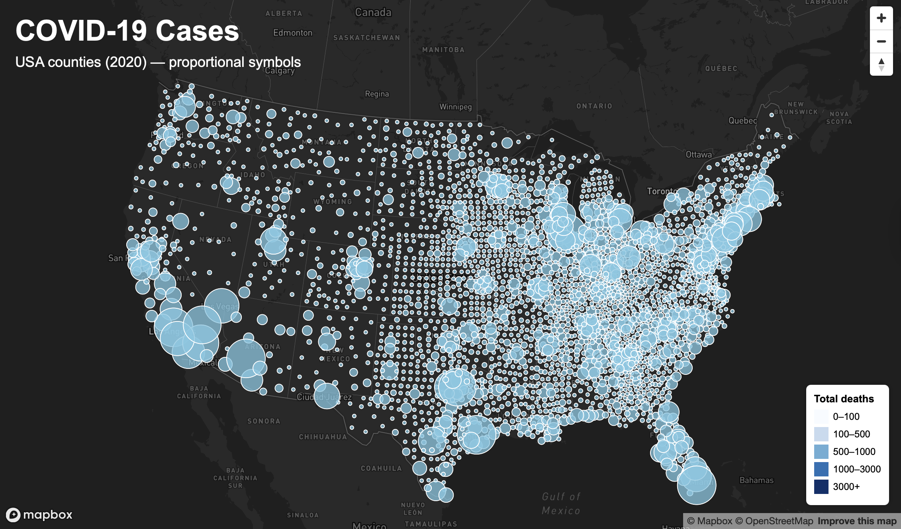
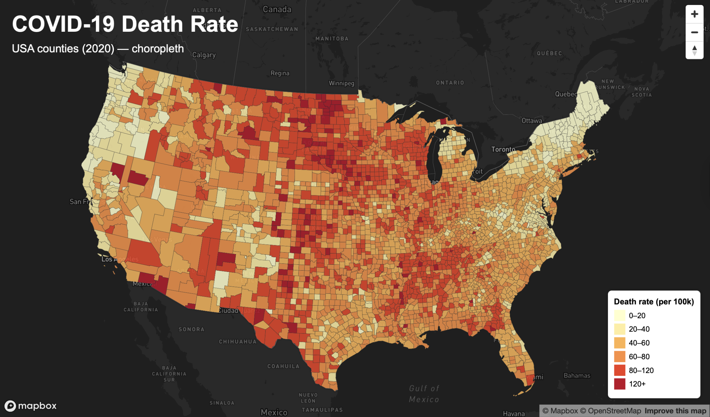

# Lab 3: COVID-19 Web Maps

## Overview

For this lab, I built two interactive web maps using Mapbox GL JS to visualize COVID-19 impacts across U.S. counties in 2020. The goal was to experiment with different cartographic techniques and understand how design choices change how patterns are interpreted.

Instead of showing the same data twice, I used two different visualization styles to communicate different stories:

• Map 1 → proportional symbols (total deaths)  
• Map 2 → choropleth (death rate per 100k people)

This helped me compare **absolute counts vs normalized rates**, which show very different spatial patterns.

---

## Map 1 – Proportional Symbol Map (Total Deaths)

This map uses circle markers sized by the total number of deaths in each county.

### Design choices

• Larger circles = more total deaths  
• Dark basemap for contrast  
• Light blue symbols so they stand out clearly  
• Legend grouped into ranges (0–100, 100–500)

### What I notice

The largest circles cluster around major population centers like:

• New York  
• Los Angeles  
• Chicago  
• Florida metro areas  
• Texas cities  

This makes sense because total deaths are strongly related to population size. Big counties naturally show bigger circles.

So this map mostly highlights **where more people live**, not necessarily where risk was highest.

---

## Map 2 – Choropleth Map (Death Rate per 100k) 

This map shows death *rates* instead of raw counts using a color gradient from light yellow → dark red.

### Design choices

• Sequential color ramp (light = low, dark = high)  
• Step classification for easier comparison  
• County boundaries outlined for clarity  
• Custom legend with exact ranges  

### What I notice

This map shows a very different pattern compared to the symbol map.

Higher death rates appear in:

• Midwest  
• Southern states  
• Some rural counties  

Even though these places don’t always have large populations, the rate is high relative to their size.

This helps reveal **risk and impact**, not just totals.

---

## Why use two map types?

Using both maps together helped me understand something important:

• Proportional symbols → show magnitude  
• Choropleth → show relative intensity  

If I only showed totals, I would miss areas with high risk.  
If I only showed rates, I wouldn’t see overall scale.

So combining both gives a more complete story.

---

## Technical workflow

Here’s what I did step-by-step:

1. Organized project folders (assets, css, js)
2. Loaded GeoJSON county data
3. Built two separate HTML pages (map1.html, map2.html)
4. Styled maps with Mapbox GL JS layers
5. Added popups and hover effects
6. Created custom legends using HTML + CSS
7. Adjusted colors and sizes until the maps felt clear and readable

One challenge I had was making sure the property names matched the GeoJSON fields (for example `rates` vs `death_rate`). Once that matched correctly, the choropleth worked.

---